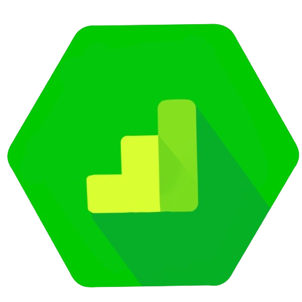

<p align="center">
      
</p>

# dataform-ga4-sessions

`dataform-ga4-sessions` is a Dataform package to prepare session table from Google Analytics 4 (GA4) raw data.

[Get started](#get-started) •
[Usage Examples](#usage-examples) •
[How it works](#how-package-works) •
[Session table schema](#result-session-table-schema) •
[Contributing](#contributing)

## Features

- Easy and fast way to create a session table from GA4 raw data without writing SQL
- Get session source/medium, campaign, and other traffic source dimensions
- Get session default channel grouping by the rules close to GA4 definitions
- By default, you get two attribution models: last click and last non direct click
- Base session assertions: timeliness, completeness, validity
- Set a result session table schema: standard or extended
- Highly customizable: add your own columns, processing steps, source medium rules etc.

## Get started

1. Initialize a new Dataform project and initialize development workspace following the instructions [here](https://cloud.google.com/dataform/docs/quickstart-create-workflow).

2. Add dataform-ga4-sessions to your project dependencies in `package.json`.

For example your `package.json` could look like this:

```json
{
  "name": "my-dataform-project",
  "dependencies": {
    "@dataform/core": "2.6.7",
    "dataform-ga4-sessions": "https://github.com/ArtemKorneevGA/dataform-ga4-sessions/archive/refs/tags/v0.1.1.tar.gz"
  }
}
```

You could find the package latest version [here](https://github.com/ArtemKorneevGA/dataform-ga4-sessions/releases).

And click "Install packages" in the Dataform web UI.

3. Add the following code to your `definitions/sessions.js` file:

```javascript
const ga4 = require("dataform-ga4-sessions");

// Define your config
const sessionConfig = {
  dataset: "analytics_XXXXXX",
  incrementalTableName: "events_XXXXXX",
};

// Declare GA4 source tables
ga4.declareSources(sessionConfig);

// Create sessions object
const sessions = new ga4.Sessions(sessionConfig);

// Publish session table
sessions.publish();

// Publish session assertions
sessions.publishAssertions();
```

In the example above we define sources: GA4 dataset (analytics*<property_id>) and last day table names (events*<date>). Declare these source using `declareSources` method.
After that declaration package could refer to source tables. You could also use ref method to select data from GA4 raw tables like this:

```javascript
ref("analytics_XXXXXX", "events_XXXXXX");
```

In the next step we create a session object, and call `publish` method and `publishAssertion` method.

Before executing these actions, you could check the Compiled Queries for incremental and non-incremental tables. Run these queries or copy and play with them in BigQuery Studio.

After that you can execute actions by name (`sessions`) or by tag (package adds tag like `analytics_XXXXXX` GA4 dataset name)

## Usage Examples

### Change the result table name and dataset

By default, the package creates `sessions` table in `dataform_staging` dataset, but you could change result table name and dataset like this:

```javascript
const sessions = new ga4.Sessions(sessionConfig);

sessions.target = {
  schema: "my_schema",
  tableName: "my_sessions_table",
};

sessions.publish();
```

### Add custom columns from raw GA4 data

```javascript
const sessions = new ga4.Sessions(sessionConfig);
sessions.addColumns([
  { name: "device.web_info.browser", columnName: "browser" },
]);
sessions.publish();
```

### Add value from event_params

You should specify the value type: string, int, double, float. For example `string` (from value.string_value).

```javascript
const sessions = new ga4.Sessions(sessionConfig);

sessions.addEventParam([{ name: "session_engaged", type: "string" }]);
sessions.publish();
```

Use `COALESCE` type to get the first not null value of any type converted to a string. For more details check out [getSqlUnnestParam](https://github.com/ArtemKorneevGA/dataform-ga4-helpers/blob/b695120595cf1c6f0d86fe6aab031e01e8e2756b/index.js#L25)

### Add value from page_location query parameter

```javascript
const sessions = new ga4.Sessions(sessionConfig);

sessions.addQueryParameters([
  { name: "fbclid" },
  { name: "ttclid" },
  { name: "gclid", columnName: "gclid_url" },
]);
sessions.publish();
```

In this example we change the column name for `gclid` from query parameters because the standard schema already has column gclid from `event_params`.

### Apply extend preset

```javascript
const sessions = new ga4.Sessions(sessionConfig);
sessions.applyPreset("extended");
sessions.publish();
```

You could compare schemas for standard and extended presets [here](#result-session-table-schema)

### Delete columns from the result table

If you don't want to store some columns but you need them for processing steps you could delete them using `sessions.postProcessing.delete` like this:

```javascript
const sessions = new ga4.Sessions(sessionConfig);

sessions.postProcessing.delete = [
  ...sessions.postProcessing.delete,
  ...["gclid", "content"],
];

sessions.publish();
```

By default deleted: source, medium, campaign as they already stored in `last_click_attribution` column.

### Add where condition for non-incremental table

```javascript
const sessionConfig = {
  dataset: "analytics_XXXXXX",
  incrementalTableName: "events_XXXXXX",
  nonIncrementalTableEventStepWhere:
    "_table_suffix between format_date('%Y%m%d',date_sub(current_date(), interval 3 day)) and format_date('%Y%m%d',date_sub(current_date(), interval 1 day))",
};
const sessions = new ga4.Sessions(sessionConfig);
sessions.publish();
```

For incremental you could use the similar method `incrementalTableEventStepWhere`. But this method applied to the first step, not to the last. So use it carefully as you could filter events before extracting from them for example source / medium values.

### Change lookback window for last non direct click attribution

By default 30 days. But you could change this value like this:

```javascript
const sessions = new ga4.Sessions(sessionConfig);

sessions.LastNonDirectLookBackWindow = 90;
sessions.publish();
```

### Adding custom source / medium rules

In this example we add a new source / medium rule: if we have `gclid` in the page_location source / medium should be `google / cpc`

```javascript
const sessions = new ga4.Sessions(sessionConfig);
// Add column with query parameter gclid
sessions.addQueryParameters([{ name: "gclid", columnName: "gclid_url" }]);

// Add sourceMediumRule for gclid
sessions.sourceMediumRules = [
  {
    columns: ["gclid_url"],
    conditionType: "NOT_NULL",
    conditionValue: "",
    value: {
      source: "'google'",
      medium: "'cpc'",
      campaign: "campaign",
    },
  },
  ...sessions.sourceMediumRules,
];
sessions.publish();
```

Here we add new rule in `sourceMediumRules`. The order is important, if we add a new rule at the end it wouldn't work as default source medium rule would be applied first.

### Disables some steps

Here the example how to disable processing steps:

```javascript
const sessions = new ga4.Sessions(sessionConfig);

// Ignore all processing steps except the first
sessions.skipLastNonDirectStep();
sessions.skipChannelStep();
sessions.skipSourceMediumStep();

sessions.publish();
```

The order is important as each step uses the preceding step. So you can't skip the channel step and have a last_non_direct step. But you could delete all the steps, and add your own processing steps.

## How package works

The package provides Session class with `publish` method that generates SQL and then uses Dataform core [publish](https://cloud.google.com/dataform/docs/reference/dataform-core-reference#publish) method to generate incremental and non-incremental session table.

Before you could use `publish` GA4 sources tables should be declared, as they are referred by `ref(this._source.database, this._source.dataset, this._source.nonIncrementalTableName)` and `ref(this._source.database, this._source.dataset, this._source.incrementalTableName)`. That's why GA4 raw tables should be declared first. You could use the same config for both `declareSources` and `publish` methods like this:

```javascript
// Define your config
const sessionConfig = {
  dataset: "analytics_XXXXXX",
  incrementalTableName: "events_XXXXXX",
};

// Declare GA4 source tables
ga4.declareSources(sessionConfig);

// Create sessions object
const sessions = new ga4.Sessions(sessionConfig);

// Publish session table
sessions.publish();
```

By default the value of nonIncrementalTableName is `events_*` but you could also provide other values.

The package processes raw GA4 data in a few steps. By default these steps are:

| Step Name                          | Description                                                                                                                         |
| ---------------------------------- | ----------------------------------------------------------------------------------------------------------------------------------- |
| events                             | Extract the needed columns from all events. Generate session_id                                                                     |
| sessions_base                      | Group events into sessions by session id. Add standard columns like: session_start, session_end, session_engaged, landing_page etc. |
| sessions_with_source_medium_and_lp | Apply source / medium rules to create last click attribution                                                                        |
| sessions_with_channel              | Add channel grouping based on source / medium                                                                                       |
| sessions_with_last_non_direct      | Add last non direct attribution based on lookback window                                                                            |

You could skip steps or add new steps. For more details please review `includes\processing_steps.js`.

As a final step postProcessing is applied. At the moment for postProcessing only `delete` type is supported.

## Channel grouping definition

Helper method `getSqlDefaultChannelGrouping` from `includes/helpers.js` generates a channel grouping column closed to Google definition. The method is inspired by [dbt-ga4](https://github.com/Velir/dbt-ga4/tree/main)

You could check `includes/ga4_source_categories.js` file for mapping between `source` and `source_category` and the original Google file could be found [here](https://support.google.com/analytics/answer/9756891?hl=en)

This mapping may change in the future.

## Source / medium rules

GA4 raw data already has source / medium values in event_params, but you could define additional rules. The most common case is if for some reason your traffic could miss UTM params, but has platform-specific `click id` like: dclid, fbclid, twclid, ttclid, ScClid or others. Or even Google Ads params: gclid, wbraid, gbraid.

To solve this issue you could define an extra column using `addQueryParameters` and add a new source / medium rule based on this new columns.

The order of rules is important, the first matching rule is applied. By default there are these rules:

1. if `gclid` from even_params is found the result is `google / cpc`
2. if source, medium or campaign from even_params is found the result is source, medium from even_params
3. if session_referrer is not null the result is session_referrer / `referral`

You could check the default rules definition in `defaultSourceMediumRules` from `includes/constants.js`.

## Assertions

You could add default session assertions using `publishAssertions` method.
| Name | Description |
|----------------------|------------------------------------------------------------------|
| Sessions Timeliness | Check that we have fresh sessions with a delay of no more than 2 days |
| Sessions Completeness| Check that we have sessions for all days without gaps |
| Sessions Validity | Check that sessions have all the required columns |

## Unit tests

Dataform provides unit testing functionality that allows you to write tests for your actions. The package contains unit tests for the main cases. You could find them in `definitions/tests` folder.

The main limitation of this functionality at the moment is that it doesn't support incremental tables. So in the tests before publishing we change action type to `table`.

```javascript
// Unit testing working only for table type
sessions.getConfig = () => {
  return {
    type: "table",
    schema: sessionConfig.dataset,
  };
};
```

You could run unit tests only using Dataform CLI command `dataform test`.

## Result session table schema

### Standard schema

| column_name                 | data_type                                                             | description                                                 |
| --------------------------- | --------------------------------------------------------------------- | ----------------------------------------------------------- |
| session_id                  | INT64                                                                 | Session id based on ga_session_id and user_pseudo_id        |
| user_pseudo_id              | STRING                                                                | GA client ID                                                |
| user_id                     | STRING                                                                | User ID if provided                                         |
| session_referrer            | STRING                                                                | Referrer of a landing page                                  |
| date                        | DATE                                                                  | Date of the first session event                             |
| session_start               | TIMESTAMP                                                             | Time of the first event of the session                      |
| session_end                 | TIMESTAMP                                                             | Time of the last event of the session                       |
| session_engaged             | INT64                                                                 | If session is engaged the value will be 1 otherwise 0       |
| gclid                       | STRING                                                                | Google click id from event_params                           |
| country                     | STRING                                                                | The first geo.country not null value during the session     |
| device_category             | STRING                                                                | The first device.category not null value during the session |
| language                    | STRING                                                                | The first device.language not null value during the session |
| term                        | STRING                                                                | String value of the term key from event_params              |
| content                     | STRING                                                                | String value of the content key from event_params           |
| landing_page                | STRUCT<href STRING, host STRING, path STRING>                         | Landing page href, host and path                            |
| last_click_attribution      | STRUCT<source STRING, medium STRING, campaign STRING, channel STRING> | Last Click Attribution                                      |
| last_non_direct_attribution | STRUCT<source STRING, medium STRING, campaign STRING, channel STRING> | Last Non Direct Click Attribution                           |

### Extended schema

| column_name                 | data_type                                                                         | description                                                                 |
| --------------------------- | --------------------------------------------------------------------------------- | --------------------------------------------------------------------------- |
| session_id                  | INT64                                                                             | Session id based on ga_session_id and user_pseudo_id                        |
| user_pseudo_id              | STRING                                                                            | GA client ID                                                                |
| user_id                     | STRING                                                                            | User ID if provided                                                         |
| session_referrer            | STRING                                                                            | Referrer of a landing page                                                  |
| date                        | DATE                                                                              | Date of the first session event                                             |
| session_start               | TIMESTAMP                                                                         | Time of the first event of the session                                      |
| session_end                 | TIMESTAMP                                                                         | Time of the last event of the session                                       |
| session_engaged             | INT64                                                                             | If session is engaged the value will be 1 otherwise 0                       |
| gclid                       | STRING                                                                            | Google click id from event_params                                           |
| privacy_info                | STRUCT<analytics_storage STRING, ads_storage STRING, uses_transient_token STRING> | Privacy info column for the first session event                             |
| device_category             | STRING                                                                            | The first device.category not null value during the session                 |
| mobile_model_name           | STRING                                                                            | The first device.mobile_model_name not null value during the session        |
| mobile_marketing_name       | STRING                                                                            | The first device.mobile_marketing_name not null value during the session    |
| mobile_os_hardware_model    | STRING                                                                            | The first device.mobile_os_hardware_model not null value during the session |
| operating_system            | STRING                                                                            | The first device.operating_system not null value during the session         |
| operating_system_version    | STRING                                                                            | The first device.operating_system_version not null value during the session |
| vendor_id                   | STRING                                                                            | The first device.vendor_id not null value during the session                |
| advertising_id              | STRING                                                                            | The first device.advertising_id not null value during the session           |
| language                    | STRING                                                                            | The first device.language not null value during the session                 |
| is_limited_ad_tracking      | STRING                                                                            | The first device.is_limited_ad_tracking not null value during the session   |
| time_zone_offset_seconds    | INT64                                                                             | The first device.time_zone_offset_seconds not null value during the session |
| browser                     | STRING                                                                            | The first device.web_info.browser not null value during the session         |
| browser_version             | STRING                                                                            | The first device.web_info.browser_version not null value during the session |
| hostname                    | STRING                                                                            | The first device.web_info.hostname not null value during the session        |
| continent                   | STRING                                                                            | The first geo.continent not null value during the session                   |
| country                     | STRING                                                                            | The first geo.country not null value during the session                     |
| region                      | STRING                                                                            | The first geo.region not null value during the session                      |
| city                        | STRING                                                                            | The first geo.city not null value during the session                        |
| sub_continent               | STRING                                                                            | The first geo.sub_continent not null value during the session               |
| metro                       | STRING                                                                            | The first geo.metro not null value during the session                       |
| stream_id                   | STRING                                                                            | stream_id column for the first session event                                |
| platform                    | STRING                                                                            | platform column for the first session event                                 |
| term                        | STRING                                                                            | String value of the term key from event_params                              |
| content                     | STRING                                                                            | String value of the content key from event_params                           |
| landing_page                | STRUCT<href STRING, host STRING, path STRING>                                     | Landing page href, host and path                                            |
| last_click_attribution      | STRUCT<source STRING, medium STRING, campaign STRING, channel STRING>             | Last Click Attribution                                                      |
| last_non_direct_attribution | STRUCT<source STRING, medium STRING, campaign STRING, channel STRING>             | Last Non Direct Click Attribution                                           |

## Requirements

The package depends on `@dataform/core` and [dataform-ga4-helpers](https://github.com/ArtemKorneevGA/dataform-ga4-helpers) - Dataform package with helper methods.

## License

`dataform-ga4-sessions` is licensed under the MIT License - see the LICENSE file for details.

## Contributing

Contributions are welcome! The project goal is to create `dataform-ga4-sessions` and `dataform-ga4-events` packages and based on them create packages to generate tables needed for all standard UA and GA4 reports.

## Contact Information

For help or feedback, please contact me on [LinkedIn](https://www.linkedin.com/in/artem-korneev/).
